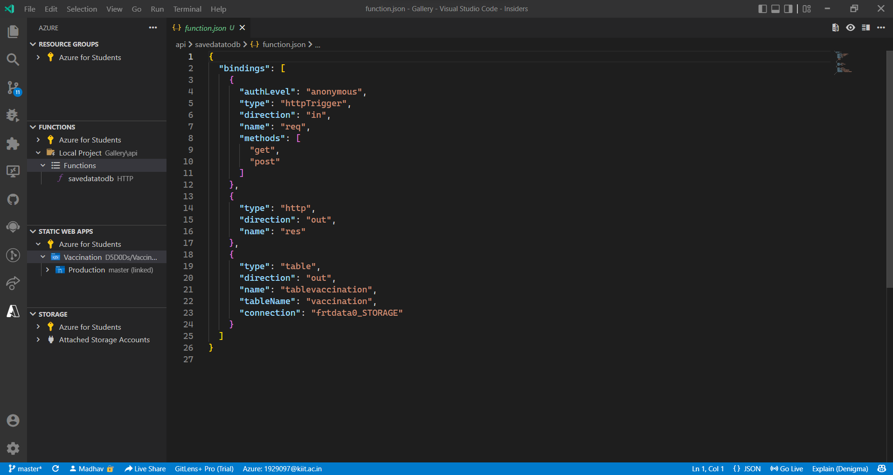

# ***Vaccination Registry***
## A free lightweight web-based tool for registering vaccinated people and the name of their vaccine.

.png)

### **Problem Statement:**

- The project attempts to provide a digital workflow reducing the burden of manual paperwork and processes for small/medium vaccination clinics that may not have the IT infrastructure to build their own tools. Centralized infrastructure can be challenging to access, use, and adapt and may not account for onsite workflows. As vaccination distribution grows, these tools hope to help smaller clinics operate more efficiently allowing more vaccinations per staff. As technology or transportation limited individuals become a larger percentage of the target population, staff responsibilities will only increase taking time away from administering vaccinations. As the COVID-19 pandemic continues and new vaccines are still being rolled out, there was a serious need to build up an app for the users' convenience to keep track and log various vaccines and vaccines for the organization who don't have resources or infra to build one for their own use.

### **Project Description:**

- This app is for Indian organizations who need an alternative to keep track of their vaccinated workforce but don't have the resource and infrastructure to do so.
- Through a GUI, it allows them to register their employees' names, emails, and the Indian COVID-19 vaccine they have taken. 
- The web app forwards the details using API in Azure tables which can be later viewed in Storage Browser.

- The project is a full-stack static web app hosted using Azure Web Apps Service. 

The API using the Azure function takes the details such as Name, Email, and, one query from a list of vaccines available in India entered on the web page made using HTML, CSS, & JavaScript and gets added in Table Storage.

The application was created in VS Code with Azure Extensions and GitHub integrations. It was later built and deployed using GitHub actions using CI pipelines with my Azure Student account.

### **Steps:**

- Create resource group and table in storage.

- Right Click on Static Web App... (Advanced) and commit with a message and selected Research Group.

- Create Table in storage and add SSL for hosting.
- Name the repository and Remote.

- Select region for Azure tasks and pushed to Github. 

- Create HTTP function using JavaScript and added bindings. 

- Add binding and choose out for API since data is sent to table.

- This creates function.json when binding is created.

- Open static week app in Azure Portal.

.png)

- Add app settings using [local.setting.json](api/local.settings.json) in the api folder and add it to [.gitignore](.gitignore) and save them.

***We created an Azure function, binding and set the configuration in the static web app.***

.png)

- Finally Modify the contents of [index.js](api/savedatatodb/index.js) and finally commit.

- Enter the details in website and click Save. After the "Saved" prompt, checkout the Storage Browser  and Functions in Azure portal.

The deployment can be viewed [here](https://ashy-rock-0ed33cf00.1.azurestaticapps.net/).
.png)

The API created provides a latency of ~268 ms which was observed in the analytics section of the Azure portal.

.png) 
    
    Skills Required: Web Development, DevOps, Microsoft Azure, Serverless Computing, Microservices